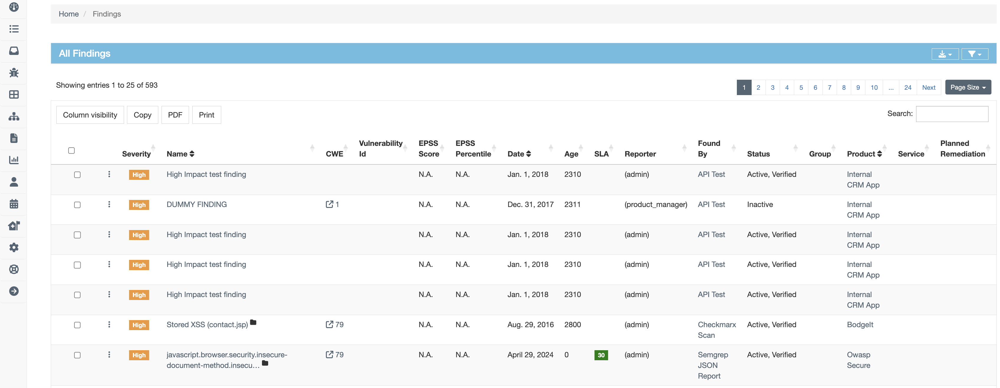

# Viewing and monitoring your Findings

After [importing](https://defectdojo.github.io/django-DefectDojo/integrations/importing/) your findings to the [DefectMojo UI](https://demo.defectdojo.org/login?next=/finding), you can view and monitor all your findings at one page.

To navigate to the **All Findings** page, go to  > **All Findings**.

 
*Fig.1: All Findings page*

You can perform following functions on the Finding page:

## Export your Findings report
Select  to [export](https://defectdojo.github.io/django-DefectDojo/integrations/exporting/) your current Findings report on a webpage, Excel, or CSV format to view them in your local system.

## Customize the Findings table

You can customize the Findings table to view and monitor the status of your Findings better. Configure the Findings table to view the required information at one glance.
 
The list of customizations are as follows:

### Column Visibility
Select the **Column Visibility** button to view only those columns that you would like to view. This helps you use the exact details that you need to monitor for your Findings.

> [!NOTE]  
> To get more information about the column headers of the table, refer to the [Generic Findings Import](https://defectdojo.github.io/django-DefectDojo/integrations/parsers/file/generic/) page.

### Copy current visible rows
Select the **Copy** button at the upper left to copy all your Findings to the clipboard on your current page.

### Export your findings in PDF format
Select the **PDF** button to download all your Findings on your current page

### Print your Findings
Select the **Print** button to print all your Findings on your current page.

### Search amongst your Findings
In this **Search** field, you can exclusively search amongst all your Findings on your current page and their respective information.

### Page size
Select the **Page size** button on the upper right corner to set your number of Finding rows to view on a single page.

### Bulk edit
Check the checkboxes in the first column of the **All Findings** table to select and edit any or all the Findings. 

> [!Important]  
> This feature is available only on the **Findings** page. For more information, refer to  [Bulk Edit Menu](https://defectdojo.github.io/django-DefectDojo/integrations/exporting/)  section under "Adding and Removing Tags" section.

### Filter your Findings table column 
To filter your Findings on your current page, select  on the upper right corner. 

> [!NOTE]  
> To know more about various filter parameters and tags, refer to [Filtering](https://defectdojo.github.io/django-DefectDojo/integrations/exporting/) under "Tags" section. 

